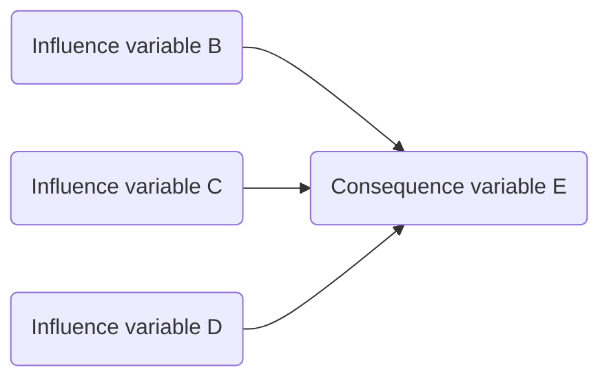
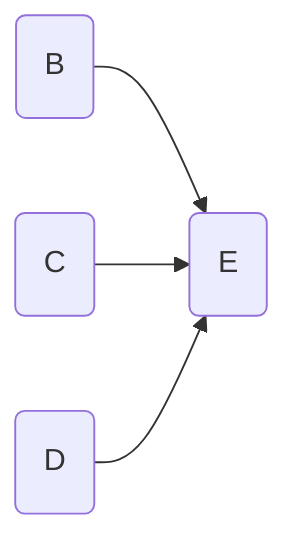
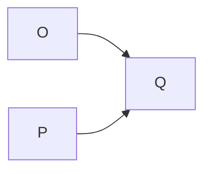
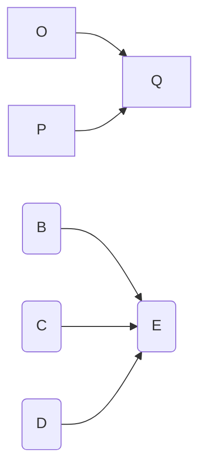
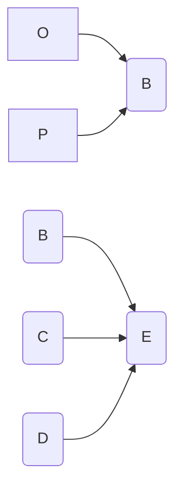
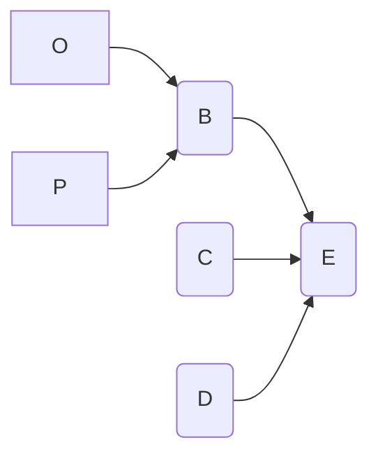
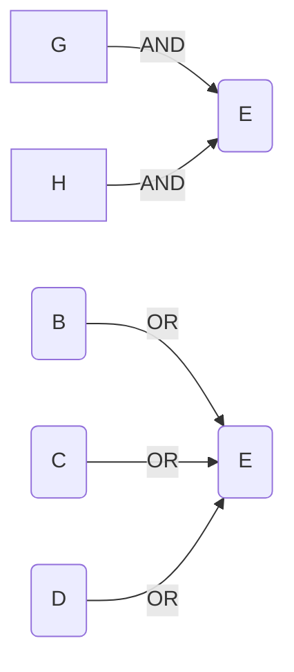
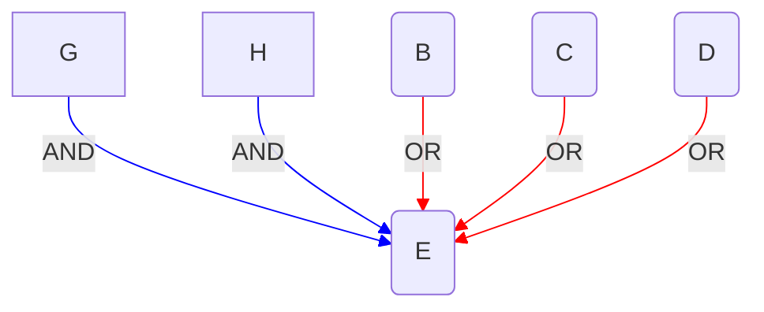
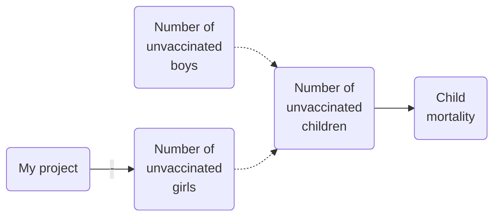
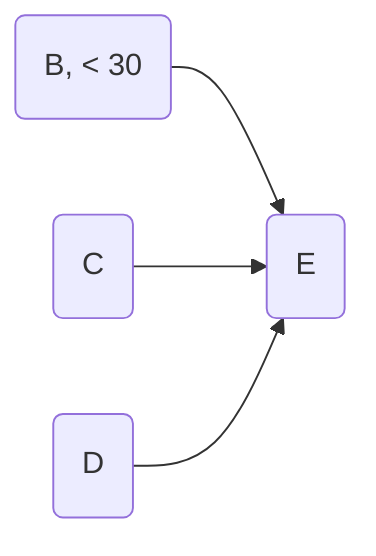

# The inference rules for causal maps

If we can agree on the inference rules, all the rest -– what symbols to use, how to combine and aggregate maps, how to translate them back into English, how to *do calculations* with them -– will follow like a charm. 

### The basic rule

> A mini-map in which one or more variables (the “influence variables”) are shown with arrows leading to another (“the consequence variable”) says, for example: “the influence variables B, C and D all have some kind of causal influence on the consequence variable E”.  That sentence is equivalent to the map below.




This is a “mini-map”: one or more variables are shown with arrows leading to another. 

You could say, ‘aha but the sentence contains the words “causal influence” so you have explained one mystery with another. If you take that part out, the diagram could be about anything, and the arrows might mean “is larger than” or “is a child of”, or lots of things’. That’s true, but the whole point is that we will specify not just this inference rule for causal maps, but enough different ones that only causality is left as a possible interpretation of their meaning. Or, to put it differently, if we have a child who can use `+` perfectly, we aren’t bothered if they can explain it in words or not; if you understand the inference rules, you understand enough.  If you want to test whether someone understands how to code QuIP information correctly, you can ask them to make various inferences with the maps. 

Again: we are not going to say what “causal influence” means. We are going to show how it works.

Some of these rules will seem pretty trivial and obvious. They should. But they are necessary for building up a complete and consistent system. In any case I need them to make an app which actually works, and we need to spell them out so we can agree how to code with the app.

### Combination rule

The next rule says that you can combine mini-maps into larger maps and vice-versa. So from this:



and, say, this



you can deduce this (and vice-versa):



#### **Interpretation**

It seems so trivial it is hard to put into words. In short: you can combine two causal maps into one. If you know that these pink things influence those green things, and you know that these red things influence these blue things, then you know that these pink things influence those green things *and* that these red things influence these blue things^[though this motivation via knowing about stuff is a cheap sell and not strictly true -– it is a psychological claim and really we are not talking about psychology].  

#### Note on context

This rule only works as stated providing both mini-maps are *from the same context*. All maps actually have a context attached to them in which they are claimed, stated, posited, uttered, etc. I am not going to deal much with context at this point, i.e. I will assume that all the maps come from the same unspecified context, but it is really important. In general, the combined map is only true in the *intersection* of the contexts. (So if one map is true for females, and the other is true only for young people, the combined map is true only for girls).

### Chaining (transitivity)

The next rule says that you can chain mini-maps with common variables. So from this:



you can deduce this (and vice-versa):



#### **Interpretation**

This is a much bigger deal. It say that if O, given some combination of other variables and in a particular context, influences B, and B influences E in the same way, then O has some influence on E too. 

#### Caveat: conflicts

What happens if the two (or more) maps we are combining result in a complete or partial contradiction? We will deal with that later.

#### Caveat: loops

There might be some caveats about not creating loops which we won’t go into here.

#### Caveat: combinations

What about the mini-maps which we join up result in different combinations of  influences on the same variable, as here? From this ..…



..… in general we have to remember these different combinations, because we can’t assume we can combine them without further ado. Here the arrows have been coloured to show this. 




#### Issues with transitivity

What’s quite weird about the chaining rule is that there are two versions of it which are in a sense opposite extremes. One is, as above:  “the influence variables all have *some kind of causal influence* on the consequence variable” and the other is  “the influence variables all have *total causal control* of the consequence variable”. So the first is satisfied for B if there are some, any, values of C and D such that some difference on B makes a difference to E (it might be that most of the time, tweaking B does nothing to E), and similarly for C and D.  Whereas in the second version, there is no room for E to do anything not dictated by B, C and D.  It’s intriguing that a lot of the other inference rules are oblivious to this distinction. Anyway, we’ll stick with version 1, as above.

If 

> A completely controls B

and 

> B completely controls C

we can conclude that

> A completely controls C

Similarly, if 

> A has at least some causal influence on B (i.e. there is at least once context in which it might make make a difference to B)

and

> B has at least some causal influence on C

we can conclude that

> A has at least some causal influence on C

These are (arguably?) two of the rules of causal inference. 

So for example if you see this:

```{r  x201932935230}
makeToC2("
C
 B
  A

")
```

and you know that the arrows are supposed to mean “completely determines”, then you know that A completely determines C as well as B, because you are following the rules of inference for the causal arrows. 

If someone disagrees with you, they must have some different understanding of what these arrows mean.

If a second person then shows you this, can you say “yes, I knew that”?

```{r  x201932935230a}
makeToC2("
C
 A

")
```

### The rule for conceptual links

The number of unvaccinated children is a conceptual combination of the number of unvaccinated girls and the number of vaccinated boys, but it isn’t caused by them. 

The maths of causal maps which include conceptual connections too is really neat. So for example if my project increases the number of girls who are vaccinated, and we also know that total child mortality is partially caused by the number of unvaccinated children (showing conceptual connections as dotted arrows): 



..… then the causal influence travels along the lines in the direction of the arrows, oblivious to the fact that some of them are dotted, and we can infer that my project likely helped to suppress child mortality. Nevertheless the dotted lines are not causal connections.

### The Extras Rule: adding extra information, in particular about the levels or values of the variables

From this:


and, the English sentence asserted in the same context

> “Variable B = 22 “

We can conclude this (and vice versa):


The same goes for any other kind of information in English (or any other natural language, of course) which tells us something about the state, or value, or level of one or more variables like or  “Variable B is high” or  “the level of Variable B  is 22” or “Variable B is on” or even “Person B’s emotion is angry rather than sad”. 

#### Interpretation

It just says, you can move information about the levels of the variables formulated in English sentences into  similar statements on the variables themselves within the map, and back again.

### Corollary: Ordinary reasoning

From the rules above it follows that you do not need an extra rule to do ordinary reasoning with causal maps. So from the above map you can also deduce the map below. (To check, remember that we could use the Extras Rule to covert the map into the map without the extra information plus the English sentence “B = 22” and from this we can use ordinary reasoning to get the English sentence “B  < 30” which we can then combine with the map without the extra information to give the version below.)



### Metalanguage

We will also need some meta-language to talk about causal maps. Metalanguage is not part of the maps, it is a special part of English which we use to talk *about* the maps. We’ve already used some liberally above, for example the terms “influence variable” and “consequence variable”.

#### **“The cause”, “a cause”**

I prefer not to use phrases like “the cause” or even “a cause”. For one thing, these are too mixed up with our human concerns like blame, and legal responsibility, and moral judgements. For another, these words are too specialised for binary, true/false variables. Also, they are too monolithic. For example, C is certainly not “the cause” of E above.