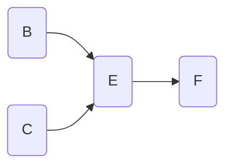

# Metalanguage

We will need some meta-language to talk about causal maps. Metalanguage is not part of the maps, it is a special part of English which we use to talk *about* the maps. We’ve already used some liberally above, for example the terms “influence variable” and “consequence variable”.

## Influence variable, consequence variable

In a map like this, we call the variables on the left the *influence variables* of E, and E is the *consequence variable* of B and C. We can also say that  B is a *parent* of E and E is a *child* of B. And we can say that both E and F are *downstream* of B and C, and that they are *descendants* of B and C, and so on.

## “The cause”, “a cause”

I prefer not to use phrases like “the cause” or even “a cause”. For one thing, these are too mixed up with our human concerns like blame, and legal responsibility, and moral judgements. For another, these words are too specialised for binary, true/false variables. Also, they are too monolithic. For example, C is certainly not “the cause” of E above.

