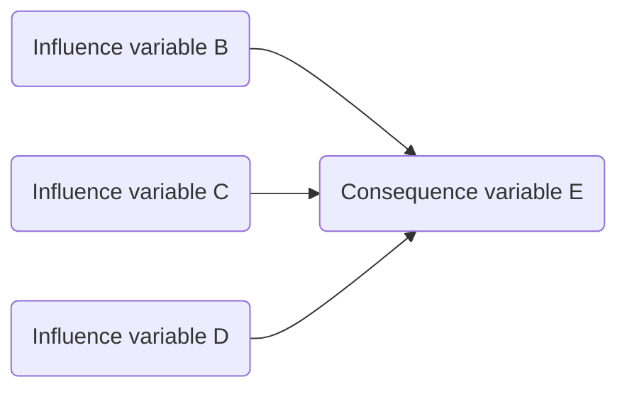
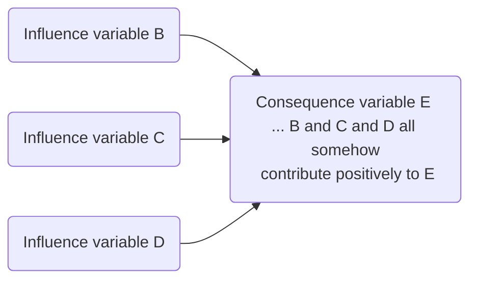

# The mini-map rule

> A mini-map in which one or more variables (the “influence variables”) are shown with arrows leading to another (“the consequence variable”) says, for example: “the influence variables B, C and D all have some kind of causal influence on the consequence variable E”.  That sentence is equivalent to the map below.

A “mini-map”: one or more variables are shown with arrows leading to another. 

In this extreme case, there is no information at all about the *content* of the causal statement from something as vague as "B and C and D all somehow contribute positively to E" to more detailed claims. Later we will see different ways in which we might encode that content. But we don't in principle need any specific way to do that, we can just write what we know on the downstream box: 

A mini-map in which the information about the *content* of the causal influence has been written on E, preceded by three dots `...` for clarity. 

Mini-maps are the atoms of causal maps. You can build up any causal network from them.

There are alternative ways of defining the "atoms", for example as multiple causal links forming a causal chain as QuIP does, or used to. Or you could also allow for more than one downstream variable. But mini-maps, defined like this, work well as atomic units. 

------------------

**Technical note**

You could say, ‘aha but the sentence contains the words “causal influence” so you have explained one mystery with another. If you take that part out, the diagram could be about anything, and the arrows might mean “is larger than” or “is a child of”, or lots of things’. That’s true, but the whole point is that we will specify not just this inference rule for causal maps, but enough different ones that only causality is left as a possible interpretation of their meaning. Or, to put it differently, if we have a child who can use `+` perfectly, we aren’t bothered if they can explain it in words or not; if you understand the inference rules, you understand enough.  If you want to test whether someone understands how to code QuIP information correctly, you can ask them to make various inferences with the maps. 

Again: we are not going to say what “causal influence” means. We are going to show how it works.

Some of these rules will seem pretty trivial and obvious. They should. But they are necessary for building up a complete and consistent system. In any case I need them to make an app which actually works, and we need to spell them out so we can agree how to code with the app.

