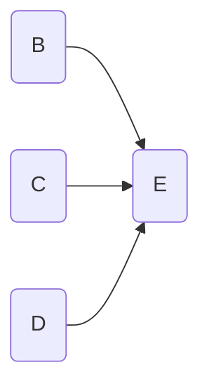
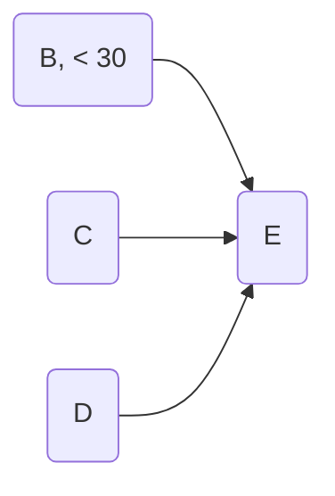

# The extras rule: adding extra information, in particular about the levels or values of the variables

From this:

and, the English sentence asserted in the same context

> “Variable B = 22 “

We can conclude this (and vice versa):

The same goes for any other kind of information in English (or any other natural language, of course) which tells us something about the state, or value, or level of one or more variables like or  “Variable B is high” or  “the level of Variable B  is 22” or “Variable B is on” or even “Person B’s emotion is angry rather than sad”. 

#### Interpretation

It just says, you can move information about the levels of the variables formulated in English sentences into  similar statements on the variables themselves within the map, and back again.

### Corollary: Ordinary reasoning

From the rules above it follows that you do not need an extra rule to do ordinary reasoning with causal maps. So from the above map you can also deduce the map below. (To check, remember that we could use the Extras Rule to covert the map into the map without the extra information plus the English sentence “B = 22” and from this we can use ordinary reasoning to get the English sentence “B  < 30” which we can then combine with the map without the extra information to give the version below.)

