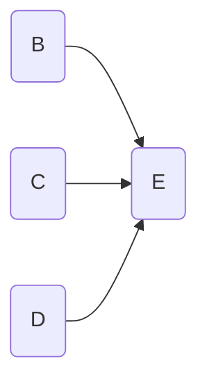
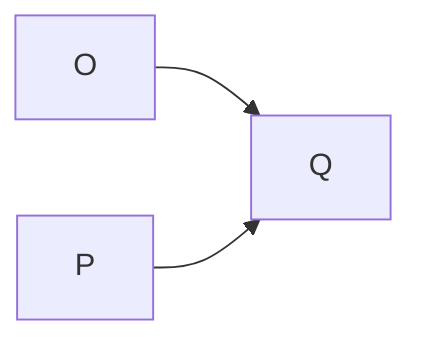
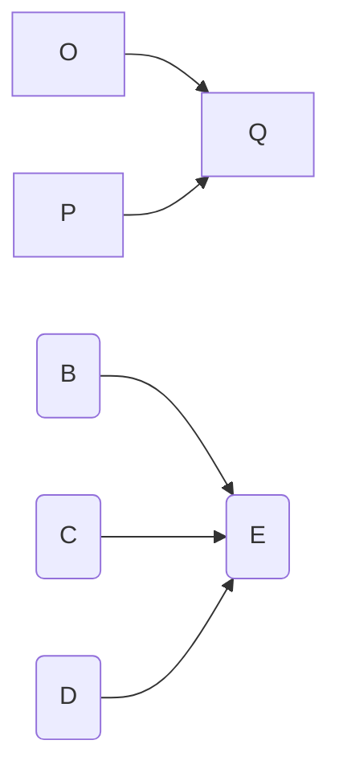

# The combination rule

The next rule says that you can combine mini-maps into larger maps and vice-versa. So from this:

and, say, this

you can deduce this (and vice-versa):

#### Interpretation

It seems so trivial it is hard to put into words. In short: you can combine two causal maps into one. If you know that these pink things influence those green things, and you know that these red things influence these blue things, then you know that these pink things influence those green things *and* that these red things influence these blue things^[though this motivation via knowing about stuff is a cheap sell and not strictly true -– it is a psychological claim and really we are not talking about psychology].  

