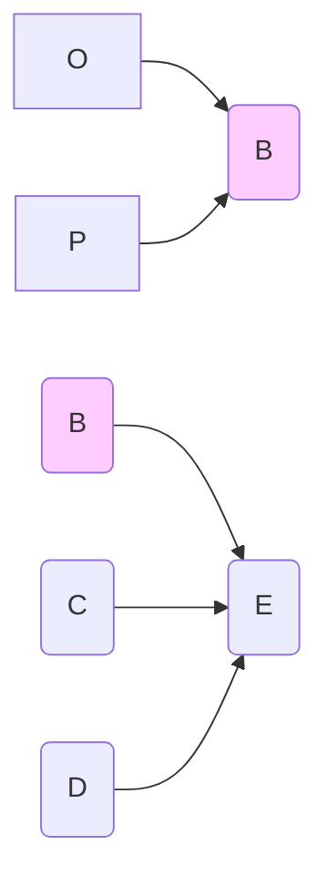
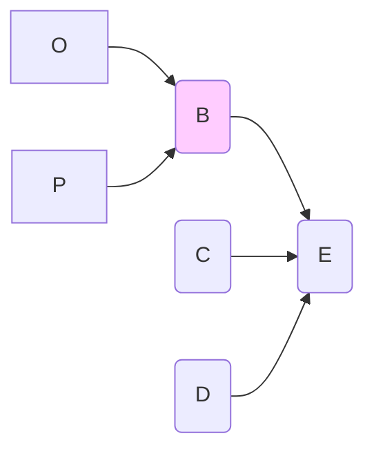

# The chaining (transitivity) rule

The next rule says that you can chain mini-maps on a common variable... 

 .... but there are cases in which this might not work, so we add: providing *this does not create a loop* and *providing the common variable not a consequence variable in more than one of the mini-maps* (we will deal with these special cases later).

So in general, from this:

you can deduce this (and vice-versa):

#### **Interpretation**

This is a much bigger deal. It say that if O, given some combination of other variables and in a particular context, influences B, and B influences E in the same way, then O has some influence on E too. 

There are some caveats, see xx.

#### Issues with transitivity

What’s quite weird about the chaining rule is that there are two versions of it which are in a sense opposite extremes. One is, as above:  “the influence variables all have *some kind of causal influence* on the consequence variable” and the other is  “the influence variables all have *total causal control* of the consequence variable”. So the first is satisfied for B if there are some, any, values of C and D such that some difference on B makes a difference to E (it might be that most of the time, tweaking B does nothing to E), and similarly for C and D.  Whereas in the second version, there is no room for E to do anything not dictated by B, C and D.  It’s intriguing that a lot of the other inference rules are oblivious to this distinction. Anyway, we’ll stick with version 1, as above.

If 

> A completely controls B

and 

> B completely controls C

we can conclude that

> A completely controls C

Similarly, if 

> A has at least some causal influence on B (i.e. there is at least once context in which it might make make a difference to B)

and

> B has at least some causal influence on C

we can conclude that

> A has at least some causal influence on C

These are (arguably?) two of the rules of causal inference. 

So for example if you see this:

and you know that the arrows are supposed to mean “completely determines”, then you know that A completely determines C as well as B, because you are following the rules of inference for the causal arrows. 

If someone disagrees with you, they must have some different understanding of what these arrows mean.

If a second person then shows you this, can you say “yes, I knew that”?

