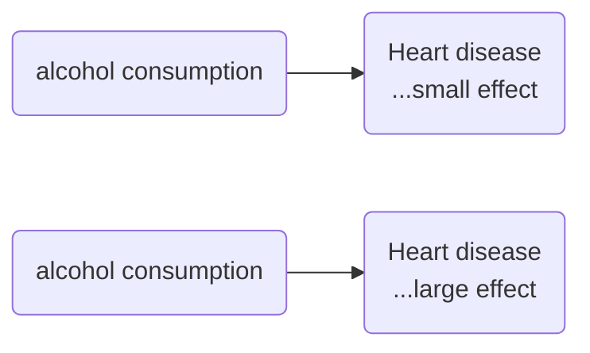
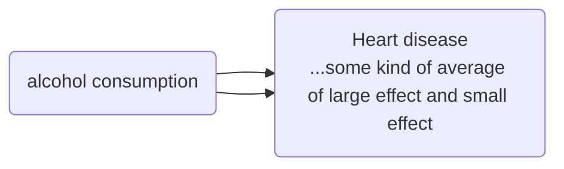
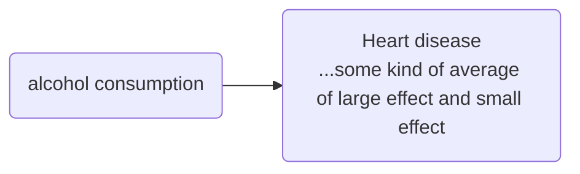
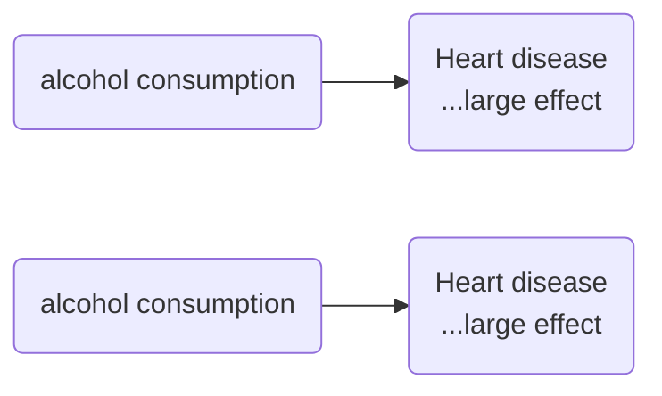
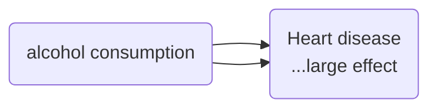
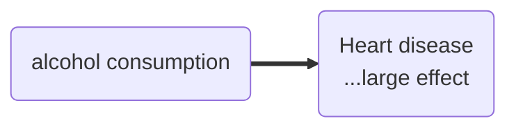
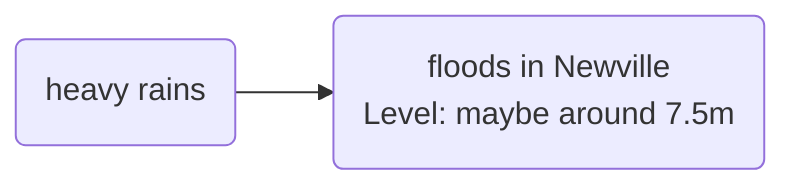

# The chaining rule with different versions of the same arrow

The first special case of the chaining rule is when the mini-maps we are combining contain two or more arrows which are co-terminal, i.e. with the same influence variable and same consequence variable. The problem is with the nature of the combined causal link.

If we hear:

> heart disease increases strongly with alcohol consumption 

and

> heart disease is hardly affected by alcohol consumption 

... we might not be sure how to combine these. We might combine the variables, but mark the consequence variable like this?

In the absence of any other information, we perhaps suggest some kind of average influence.

Or we might combine the arrows as well as the variables...

The situation seems simpler when the information is not contradictory:

If we hear:

> heart disease increases strongly with alcohol consumption 

and

> heart disease increases strongly with alcohol consumption 

... we are usually only too happy to combine the mini-maps, with some kind of understanding that this link is now a little stronger or has more evidence in some sense.

... we are usually happy also to combine the arrows and we might want to visually indicate that this link is now a little stronger.

## Combining "extra" information like the values or levels of variables

The problem is similar when the mini-maps we want to combine agree in their causal information but differ in the extra information like the values of variables:

> the heavy rains last week led to 10m floods in Newville

and

> the heavy rains last week led to 5m floods in Newville

we would not be able to encode them in the same way but might do it like this:

