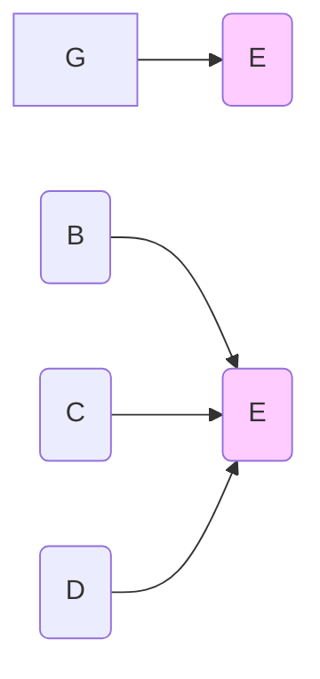
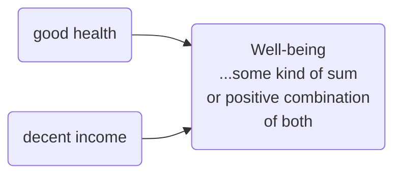
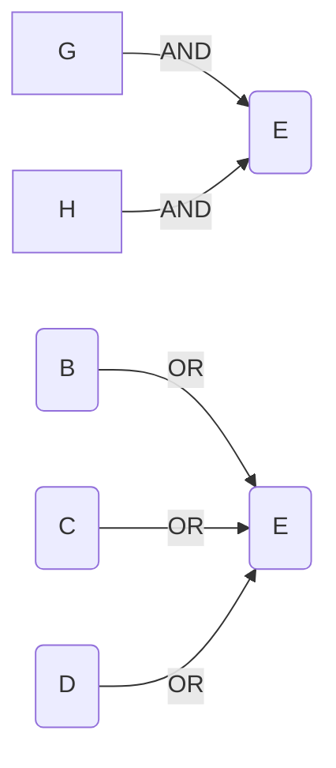
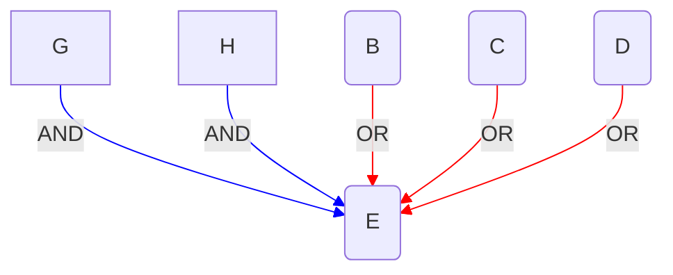

# The chaining rule with a shared consequence variable

The second special case of the chaining rule is when the mini-maps we are combining contain **two or more arrows which are have different influence variables and the same consequence variable**. Again, the problem is with the nature of the combined causal link.

Our common sense pulls us in different ways about what to do in different cases. 

Sometimes we might feel this is a complete or a partial contradiction, in other cases not.

If we hear that G affects E, and then we hear that B, C and D affect E, there are different ways to respond.

For example, if we hear:

> good health contributes to well-being

and

> a decent income contributes to well-being

we are probably happy to encode them like this:

It has to do with whether we think of "G ▶ E" as meaning 

> only G affects E

or

> G (and possibly other things) affects E

In the first case, the second mini-map *contradicts* the first.

In the second case, it isn't obvious how we are to understand this combination.

In particular, what about joining mini-maps in this way which encode specific but different causal contents From this ..…

..… in general we have to remember these different combinations, because we can’t assume we can combine them without further ado. Here the arrows have been coloured to show this. 

