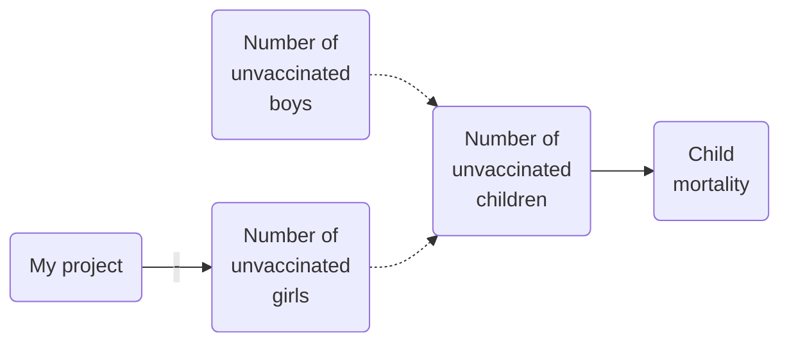
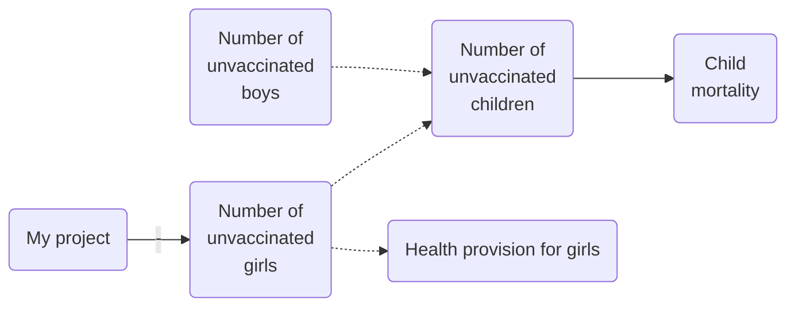

# The rule for conceptual links

The number of unvaccinated children is a conceptual combination of the number of unvaccinated girls and the number of vaccinated boys, but it isn’t caused by them. 

The maths of causal maps which include conceptual connections too is really neat. So for example if my project increases the number of girls who are vaccinated, and we also know that total child mortality is partially caused by the number of unvaccinated children (showing conceptual connections as dotted arrows): 

..… then the causal influence travels along the lines in the direction of the arrows, oblivious to the fact that some of them are dotted, and we can infer that my project likely helped to suppress child mortality. Nevertheless the dotted lines are not causal connections.

#### Variations

In the simplest case, conceptual definitions are tree-like. But in real life we get real headaches with concepts which mutually define one another. Or with concepts which are part of various other concepts, like in the next figure. If we are going to track the influence of “my project”, we don’t want to unfairly exaggerate it because is part of two broader concepts? Or do we?

