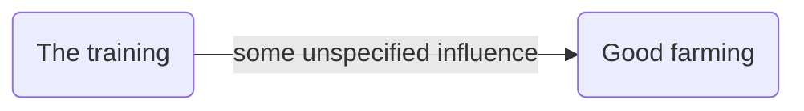
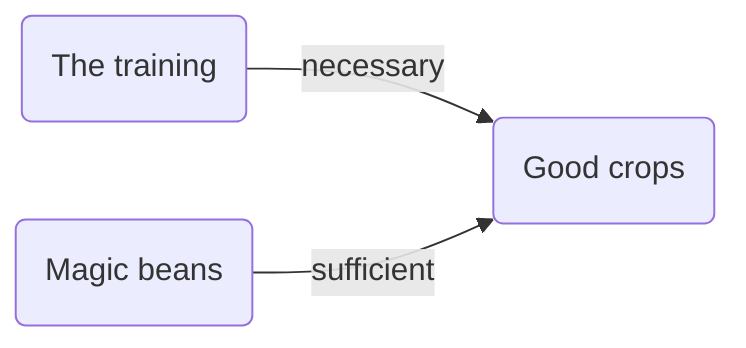

# Inference in Theorymaker


```{r setup, include=FALSE}
library(tidyverse)
library(ggplot2)
library(shiny)
library(DiagrammeR)
knitr::opts_chunk$set(echo = FALSE,cache = T)
source("C:/Users/steve/Dropbox/Projects/causal-mapping/combo_functions.r")


```

##  The problem

In the most basic situation, we have information about some unspecified influence of one variable on another.



The influence is hardly ever completely unspecified. We might hear things like this:

- You can't have E without B
- Mostly, Bs are Bs
- More of B means more of E
- B happened and then E happened
- E was poor because of B
- B is good for E
- B reduces E
- B is quite good for E
- B doesn’t have much effect on E

More generally there is more than one influencing variable

- B and C combine synergistically to influence E

- B and C have contrary influences on E

  etc.

and so on. On the other hand, we are unlikely to hear a neatly-specified function either. How to encode this information?

- also, (a related problem) How to make sense of any kind of qualifying information like strength, trust, confidence, reliability, probability, class membership etc. Obviously these do not all mean the same thing, but we could at least start by looking at how to implement even some generic version, which we will call “strength”.

## How to encode causal influences in the app

The app already realises the coded networks as actual R objects, within which the variables or nodes have an attribute called `level` e.g. 0 or 1. Also there is an attribute called `fun` which stores the function which the variable uses to calculate its own level on the basis of the levels of the variables directly upstream of it.  (Strictly, there might be more than one set of influence variables, so the `fun` attribute is stored with each such set.) . 

Our job when coding the causal link is to specify this function (and if there is more than one combination of influencing variables, to code one function for each set). We should also code the level of the variable, if we know it.

The point of this is not really to do actual calculations or predictions. Rather, we want clarify our thoughts about what we actually mean by the different functions like "NOT", "NECESSARY" etc and ideas like the "STRENGTH" of a causal influence. 

In general, the variables are typeless so you can give any variable a level of 1, or -2090, or "fish" or anything you want, and the function attached to the variable(s) directly downstream of it can maybe make sense of that, or maybe not. 


## Restriction to lo-hi variables and functions between them

Usually we think of functions as having the form $$E = f(V)$$ where V is some set of influencing variables e.g. B, C etc.

But more generally we will allow for functions of the form $E = f(Ep, V, s)$ where Ep is the prior level of E, the level without the influence of V, and where s is the strength of the influence, between 0 and 1.

In this approach I'm going to concentrate on "lo-hi" variables which have a continuous numerical value between 0 and 1. This is pretty good for expressing a lot of the variables we encounter, so wellbeing of .9 would be pretty amazing, 0 is impossibly bad. 

We will create a bunch of functions to encode causal information which are all defined on the same range, so they all tell you how to go from values between 0 and 1 to produce another value between 0 and 1.

This is really useful because it means in principle we can combine and overlay possibly conflicting information from the same or different sources. 

### Generalisation of functions usually defined on binary variables to lo-hi variables

This also means that when we encode a function like NECESSARY which we normally think of as dealing with binary 0/1 variables, it could be useful to provide a generalisation which can also deal with intermediate values. That's easily done. 

### Restriction to symmetrical functions 

In most cases, I will deal only with functions which are symmetrical in the sense that, in $E = f(Ep, V, s)$ , the order of the variables within $V$ does not matter. Most of the functions we are likely to encounter are of this nature.

## Specifying the map

### Exogenous variables and the Grid

Ideally the coder would also specify the levels of all the endogenous variables. In practice, much of this information isn't known in any detail.

If one or more of the influencing variables do not have a level specified for them, the app opens up a "Bayesian grid of scenarios" and calculates the consequences for several different levels, usually 3, of the exogenous variable in question.

So if there are 5 exogenous variables, this means there will be 3\*3\*3\*3\*3\*3 = 3<sup>5</sup> combinations to work out.

### Inference in action

When you've specified your diagram, Theorymaker can calculate the consequences on the downstream variables. 

By default, the app then calculates the mean of all the scenarios in the Grid.

At the moment, the app can cope with a network which included feedback loops, but it does not actually follow the causal path right around the loop but stops before repeating itself. 

### Some "mono functions": functions with a single influence variable


We have some candidates for mono functions:


```{r QWER}
mermaid("

graph LR
AU(The training)--PLUS -->B(Good farming)
Ax(The training)--MINUS -->Bx(Good farming)
Ab(The training)--SAME -->Bb(Good farming)
Ac(The training)--NOT -->Bc(Good farming)
Ay(The training)--NECCESSARY -->By(Good farming)
Az(The training)--SUFFICIENT -->Bz(Good farming)

")
```

Here, PLUS is identical to SAME, MINUS is identical to NOT.

### Some “multi functions”: functions with a more than one influencing variable:


```{r QWER2}
mermaid("

graph LR
AU(The training)--AND -->B(Good crops)
AR(Good rainfall)--AND -->B(Good crops)
AS(Good soil)--AND -->B(Good crops)


")
```


In these graphs, the range of points in the vertical columns are generated by different possible *prior* values of Y, i.e. values which it would have taken if X hadn't been influencing it. 


```{r fig.width=10}
gfun2("SA")
gfun2("NOT")
gfun2("SQ")
gfun2("NECC")
gfun2("MIN")
gfun2("MIN2")
gfun2("MAX")


```


Is NECC based on min or *?


#### Necessary & sufficient conditions

Generalised:

- arbitrarily many necessary conditions
- variables between 0 and 1
- strength


I’m not sure about the way you suggest treating necessary and sufficient conditions (e.g. by putting an `n` or an `s` on an arrow) is complete yet. It suggests that someone could consistently think this:



..… but they couldn’t, could they? If the beans are sufficient, you don’t need to know anything about the training, so it can’t be necessary. If the training is necessary, the beans can’t be sufficient (because if there was no training, the beans wouldn’t be enough). 


