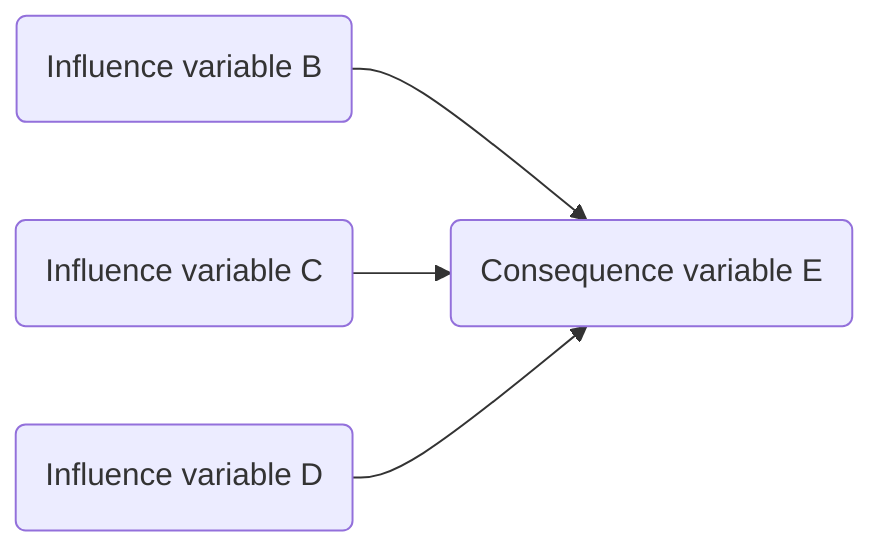

# Bayesian inference

Is it enough to process information *down* the network? No. Cause can by definition only flow down it. But we might have information which implies something about antecedents, which means we have to reason *backwards*.

Arrows can be coded with information on specificity and sensitivity, so we can use Bayes’ rule to modify our prior information about the upstream variable(s). 

Not implemented, but soon.

