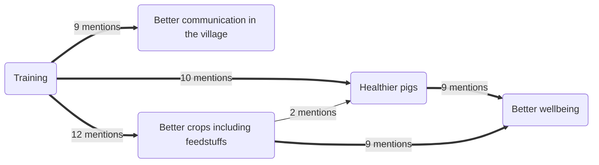

# Metrics

## Network metrics

## Homogenity of paths

Scenario 1) 20 people might have said that A links to B and another different 20 might have said that B leads to C with no overlap between the groups of people. 

Scenario 2)  the same 20 people say that A links to B *and* that B leads to C.

Conventional ways to combine the information from the different sources would produce the same diagram in both scenarios. But we want the user to see that there is some kind of weakness in scenario 1. Can't we just show this on the arrows somehow?

In the case of isolated paths with no forks in them, which of course are very rare, this wouldn't present a big problem. Assume that we are showing, as we do, now the total number of mentions for each section represented by for example the width of the arrow.

We can construct a measure which we could call "homogeneity" for each section. So if in a long path, each of the sections were mentioned by more or less the same people the stretch would have high homogeneity and you could for example show it unbroken. In contrast, for an arrow in which separate sections were mentioned by different groups of sources, it would have low homogeneity and you could show that for example with a very broken arrow with lots of gaps in it. Or by making it almost transparent. 

However I don't think this works in the much more common case when paths are of course constantly diverging and rejoining. 

For example, suppose you have an arrow from B to C and then an arrow from C to X and another from C to Y; suppose there was high homogeneity from B to C to X in the sense that both of these sections were mentioned by many sources but the section from C to Y was mentioned by a different bunch of sources. How would you mark this? 

**The problem is that homogeneity as I've described it as a metric of entire paths** and so you can't really show it in individual sections when there are forks, i.e. when one section can have different homogeneities because it is part of different paths. 

## (non-) solution 1)

What one could do is see whether there is any clustering within sources rather than within variables. So you might find there is a bunch of people who tend to mention many arrows the same and another bunch of people who mention a different set of arrows. It would certainly be possible to automatically or manually create subgroups of respondents. Then there are ways to show how different sections of paths were mentioned by these different subgroups, but it doesn't really answer the question.

## Solution 2)

You can certainly report the homogeneity of each individual path in the Report tab of the app, but that would be quite long-winded.

## Solution 3) 

You could show the same information interactively. For example when you click on B in the example above, you would see the width of the section from C to Y  shrink but the section from B to Y would stay the same. However I am not a big fan of information which you can only discover by twiddling. 

## Solution 4) 

You might want to summmarise the most important results in Solution 3 e.g. in a legend on the diagram, where you could (automatically) mention individual paths with particularly high or low homogeneity. You could probably develop a metric for the overall homogeneity of a whole diagram, and you might want to mention if a whole diagram had unusually low homogeneity. 

## Solution 5)

Allow the viewer to "play" the different sources one by one, if there aren't too many of them.

## Conspicuous absence

The basic idea is to look at the *lack* of edges: node pairs (aka variable pairs) which could have an edge (aka arrow) but don’t, or have only a thin edge, i.e. with very few mentions. The made-up example below is supposed to be built up on the basis of edge information derived from say 15 separate respondents. Is the low number of mentions of the arrow between “better crops including feedstuffs” and “healthier pigs” (below) understandable because they were anyway rarely mentioned together by the different respondents: maybe respondents tended to talk about the pigs, or the crops, but not both? Or is it *conspicuous by its absence*? We can look at the 15 individual “mini-maps” produced by the 15 respondents. Did those two nodes in fact appear together in the many of the respondents’ mini-maps but without an edge between them? This is something that we can *not* tell just by looking at the map, but a confusion-matrix-type structural analysis *can* tell us. 

One could build a global score for each edge, to complement the score for the frequency of mentions: so, 50% = this edge is present in 50% of the mini-maps in which both nodes were mentioned in some way or other. So if it turned out that “better crops” and “healthier pigs” appeared together in only two mini-maps, it would get a score of 100% and we would take it more seriously than if it had a score of say 10%. (We could also go on to look at all the arrows which are not in the map and talk about *how much* they are lacking - a kind of negative causal link.) 

The algorithm calculates this score by calculating the individual respondent-level adjacency matrices for the edges mentioned by each respondent, but scoring for *absence* rather than *presence* of edges. So each adjacency matrix only has a 1 for pairs of nodes which are mentioned by the respondent but for which no edge was mentioned. Then combine them into one large adjacency matrix of “anti-causality”.  The trouble is that I am not sure about the details -– not sure if the score should really be punishing situations when people in group 1 say that X leads to Z, and group 2 say that it leads to Y which is *between* X and Z -– that needs some more thought. In this case, you couldn’t really say that arrows from X to Z are conspicuously absent, more that these people are thinking in a more detailed way.)

In the same way, you can look at the total lack of an arrow between Better Communication and Better Wellbeing and ask aha, is this because they were never mentioned together? Or is its absence more conspicuous? 