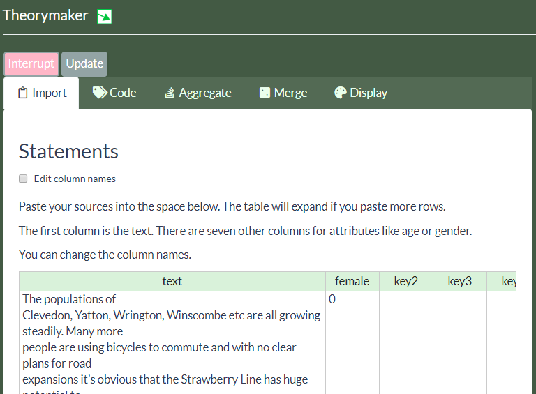
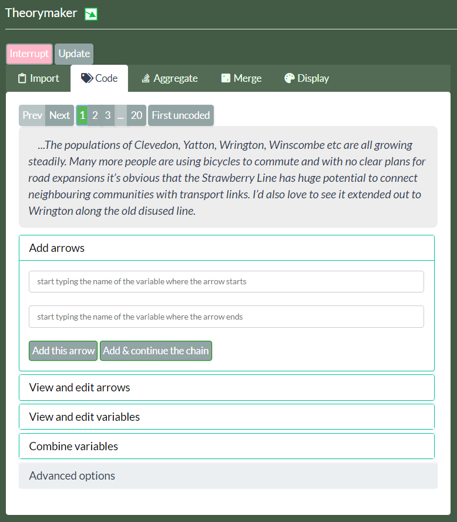
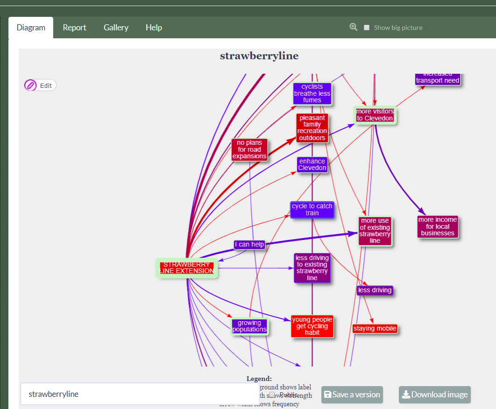

# Using Theorymaker 4 -- already partly outdated!

This app is in an alpha state. That means you can use it and it should work, you can even do real coding in it, but it may crash at any point and the app itself will change in the future so you might not be able to continue any projects which you started.

In principle, everything will happen "live" without needing to press "save", "update" etc. But during development there are a still couple of "Update" buttons, especially the one at top-left. You will sometimes need to press this, and maybe also visit the "Display" tab, to make the diagram update itself. 

Pressing the "Interrupt" button will crash the app! 

## About the tables

E.g. the table in the `Import` tab. 

These are featureful.

You can drag the columns of the arrow and variable tables around, and sort the columns.

To sort, just click on the name.

To drag, click somewhere on the header of the column but not on the name, unless you want to sort as well. The cursor should change to a hand and you can drag the column where you want it. The order is retained until you re-load from a permalink.  

Sometimes a table doesn't load properly; just click in it. They extend themselves when you paste in a lot of information, but they can seem to freeze.

## Left-hand tabs for producing and coding your diagram

**We'll look at each tab in the interface, starting with those on the left-hand side.** 

### Import

Here you paste in statements from several sources or respondents from which you want to extract causal claims. You can paste straight in from Excel, one statement or source per line (more rows will magically appear). 

To fix: if you paste in more than about 20 rows, the interface seems to freeze. So use "upload" option.

There are up to 7 additional columns for data like gender, age or role of the source. These extra categories make your Theorymaker diagrams much more interesting.

Change the names of these columns if required by clicking on "edit column names"

<!-- You can add additional sources at any time by pasting them in starting in the empty row. -->

To fix: change column names by clicking on them.

To decide: 

- at the moment, if you delete or paste over the data from this tab, it is lost. Perhaps it is better to have a more conventional "Import" function in which new data is appended to existing data.
- whether to have an option to break up larger passages into smaller ones.

You *could* make diagrams in Theorymaker4 without looking at this tab, going straight to the `code` tab and treating everything as coming from one source. It would be a very clunky way to construct a small network, maybe an interesting way of constructing a larger one. 

But you'd be missing the point of the app, which is to code and combine multiple sources. 

### Code

Here, you view each statement one by one, looking for causal links e.g. "X leads to Y". In some statements you might find more than one such link; many will have none. 

#### Pager

The bar at the top shows a pager with buttons from 1 to the total number of statements. If you have pasted some statements in on the previous tab, you can now click through and view the statements. The button "first uncoded" is one you will be using all the time as it takes you to the first statement which you have not yet coded; you will often use it as another "Next" button.

As you switch between statements, the arrows you coded for that statement are highlighted in the diagram (FIX: should use transparency rather than width.)

If you have set the "overview_column" setting to be the name of one of the attribute columns in your table of statements, then a button will appear which will show all the statements from the current source.

#### Widget for adding arrows

+ with smart search for existing variable names or ability to add new variables
+ ability to add several variables at the "from" or "two" end of the arrow (but not both) - just type a comma or press tab to enter the next one
+ option to add a quote for the arrow; just highlight any text in the statement to have it added automatically (FIX)
+ keyboard navigation for rapid data entry (press tab to move between options)
+ option to continue a chain, i.e. when you've coded an arrow from A to B, B is entered as the beginning of the next arrow (FIX)
+ option to change the strength and direction (plus/minus) for the arrow and trust we place in the source
+ option to mark this combination of incoming variables as interacting, which means a dot is placed on them in the diagram. To do this, when coding the fact that more than one variable controls another, i.e. you have more than one variable name in the top box, check the "Arrows interact?" checkbox. In future there will also be some pre-set options for the interaction like &, OR etc.

This widget is the heart of Theorymaker4. It is designed to make coding quick and easy.

In the upper box you type the names of one or more variables at the beginning of the arrow(s) and in the lower box you type the names of one or more variables at the end of the arrow(s). Separate the names with a comma or by pressing your `tab` key. What's cool is that the names of existing variables are suggested as you type. You can accept the suggestion which has a grey highlight just by pressing `Enter`.

When you have at least one variable name in both boxes, add the corresponding arrow(s) by clicking "Add this arrow", or just by pressing `Tab` until this button is highlighted and pressing `Enter`.

Tip: if you have a statement which implies a chain, e.g. A leads to B which leads to C, you can speed up coding by pressing "Add & continue the chain"; the arrow(s) are added but also the variables from the bottom box appear in the top box, to make life easier.

To decide: at the moment, you can't put *several* variables in the upper box *and* several in the lower box. 

#### Widget to View and edit arrows

This panel lets you look at the arrows you have created and edit them. Remember to press "Update" when you've finished. This table, like most others, is sortable (click on column headers) and you can paste into it, right-click for additional options, etc. 

Here you can edit: 

- the quote which goes with the statement, by default it is the whole statement or what you highlighted during coding. 
- the *trust* which you as a coder have in the arrow (you can give different levels of trust to different arrows mentioned the same source) 
- the *strength* from -1 to +1 which this statement claims the arrow has
- the *label* which appears by default on the arrow

#### Widget to View and edit variables

Here you can:

- rename variables by changing the "label"
- don't touch the `id` column unless you know what you're doing
- you can add a `group` which is useful for drill-down scenarios

You can add any columns you want. If you add one which means something to visNetwork, like `color.background`, this will be used by the app. You can add arbitrary attributes like `mynumber` and summaries for it will be available in the visualisation if you put things like `sum_mynumber_sum_sum` in the settings. 

#### Advanced options

This is just for development.

#### Missing: pane for editing variables and arrows

(FIX): you should be able to click on a variable or arrow in the diagram and then the panel on the left changes to let you edit that variable or arrow. 

### Merge

The point of this tab is to simplify the diagram - to reduce the number of arrows and/or variables. There are quite a few different ways to do this.

The features in this panel leave the original variables and arrows intact, so you can filter and recombine them in a different way later. What is saved is the original data plus the settings, clustering etc you want to use to merge the data the way you want it. 

#### Aggregate arrows

By default, all "sister" arrows which share "from" and "to" variables are combined. If you unclick the checkbox, they will be treated separately. 

####  Groups 

these are a bit clunky - they usually shown with different colours and they are shown combined initially. You can double-click to unpack the constituents (but you cannot always pack them again (but see )) (Probably DROP this feature)
  - You can only specify groups in the variables table

#### Clusters 

A better way to simplify the diagram and reduce the number of variables, probably because we want to subsume several under a new or existing variable which is more general and expresses all of them. When you activate this option, only the simplified variable is displayed instead of its constituent parts. 
- e.g. at some point while coding you decide you want to combine two variables such as "Safer cycling" and "Evening cycling is safer" by merging the latter into the former, "Safer cycling". 
- or you want to combine "Better over long-distance" and "Better over short-distance" into one variable called perhaps "Better running". 

  - Three ways to specify clusters:
    + manually in the previous tab (`code`) by editing the variables table
    + press the button to auto-generate suggestions (uses the ICLUST procedure under the hood) - you can then check and edit these manually in the `code` tab.
    + or by using the dedicated `cluster variables` widget:
        * auto-suggests names of existing variables
        * the name of the combined variable is a concatenation of the variables it includes (FIX)
        * the attributes of the combined variable (value, frequency etc) is calculated as a summary/average of the variables it includes (FIX)
* Hide arrows with fewer than a specified number of mentions
* There are two more widgets for viewing but not editing the resulting sets of arrows and variables. These are automatically now combined with attributes of the sources of the statements, e.g. to calculate % of women who mentioned the arrow or variable, `frequency` (number of arrows which have been combined) and `title` which is the tooltip shown above the arrows in the diagram.

### Display

This is a powerful tab because we can do things like 

* Choose display layout, at the moment only circular or hierarchical. Many options, not perfect yet.
+ Each display attribute like variable colour can be either:
  + set globally e.g. change the border colour of the variables (click the coloured area next to `color.border`)
  + set if... something equals, (or is greater than, or contains, etc) ... something else. 
    + e.g. you can set all variables to be `hidden` if the % of women mentioning it is less than 50%
    - e.g. hide all variables containing the word "village" (under `variable`, click the control next to `hidden` and change it to `if...`, and then type `village`) (FIX: think of a way to have multiple such settings for one attribute, e.g. red for "village" and green for "town")
  + set conditional on something e.g. set the colour or size of something to vary according to the number of mentions. 
    + e.g.set the arrow colour to reflect the average strength (from +1 to -1), weighted by frequency of mentions and average trust (FIX: add some sensible presets)
    - making the width of an arrow dependent on the number of mentions (under `arrow`, click the control next to `width` and change it to `conditional on...`, and then select `frequency`)
    - making the colour of a variable depend on the percentage of sources who were women (assuming you have say "gender" or "female" as one of your columns in the `Import` tab, under `variable`, click the control next to `colour background` and change it to `conditional on...`, and then select `gender`)
- there are lots of other possibilities!
- `Diagram` settings (bottom section) 
    - node spacing and level separation work only with the "hierarchical" option. They are important to make the text visible without crowding the diagram. 

(FIX and DECIDE) getting the diagram to look "right" is quite a big deal as it is about opinion, taste & user-group as well as technology.

## Right-hand tabs for outputs: viewing diagram etc
### Diagram

On the right is the diagram. You may need to press `Update` in the top-left corner to get the latest version. 

- **View a large version** by clicking clunky "Show big picture" button: At the top-right is a button to show the whole diagram in a larger window above. 

#### Ways to interact directly with the diagram 

- You can drag and drop a lot; just click the "edit" button on the diagram. However **at the moment, your edits will not be saved**. Not sure how useful this would be for larger networks anyway. ((ISSUE: could only save changes when the diagram is not aggregated or merged in any way.))

- Zoom  
  - zoom in and out by doing the two-finger gesture or scrolling with the mouse
- Pan
  - (move the diagram around by dragging an empty area)
- View descendants and ancestors when clicking on arrows or variables
- Move things around
- Add and edit variables and arrows
- View tooltips when hovering over variables and arrows (FIX: should be customisable)
- Double-click on a group variable to fold/unfold its descendants
- if you have used conditional formatting, a primitive legend is printed on the diagram which sort-of explains the meaning of the colours etc.

#### Save (below diagram)

- You can save a permanent link to your diagram. Type a name for it in the `Title` box, and press save. A link appears which you can click on, and/or copy and send to someone or bookmark for yourself. If you make further changes to your diagram, remember to save them again. If you want you can save them under the same title, or you can use a new title like "my-diagram-version-2". The title cannot have spaces or unusual characters. Saves a version of the diagram and (most of - FIX) your present settings.
+ Right-click to copy the diagram
+ FIX: save as png / pdf etc button
+ FIX: download your data e.g. statements, coding

#### Report

+ Here we'd have some MicroStrategy-like things, either static reports and/or interactive widgets

#### Gallery

+ FIX Gallery of examples, user's recent diagrams, etc with optional short phrase describing on each one

