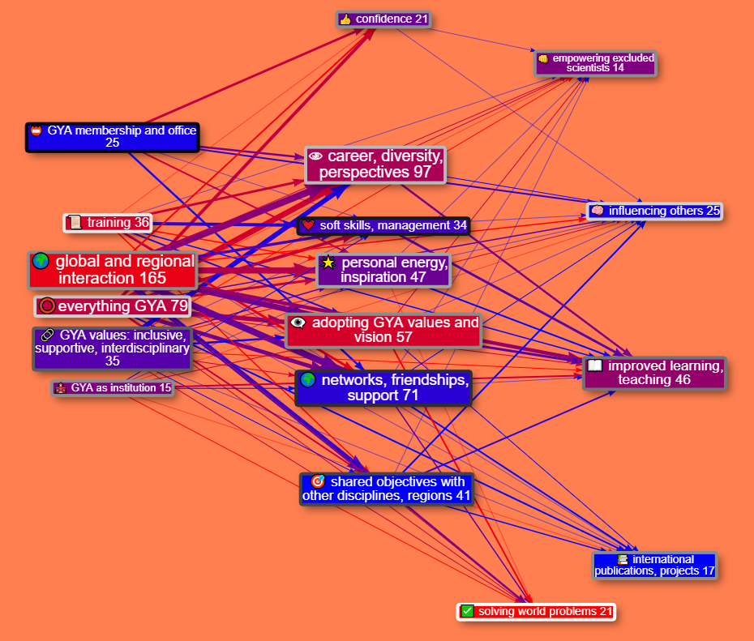

# Global Young Academy: Tracing the paths of GYA’s impact

The [Global Young Academy](https://globalyoungacademy.net/) supports young scientists around the world to connect with other young scientists, develop their careers and work towards solving global problems with science. We asked over 100 people, who had been supported by GYA or were otherwise involved in the programme, to tell us stories about positive changes which had happened because of GYA activities.[^a] We used an online survey.

This research project was completed before work started on the Causal Map App, but using similar ideas. The causal map below was made by importing the old data into the new App.

We analysed the stories looking for examples of where people had said that *$B$ leads to $C$* - for example, where someone said “I loved the regional meetings because they helped me widen my professional network”. Then all the *$B$*s (like, *Global and regional interaction*) and all the $C$s (like *networks, friendships, support*) were grouped into themes,  which are the boxes in the diagram below: a Theory of Change for GYA. All the individual stories linking $B$s and $C$s are synthesised into one story using a pre-defined set of analysis steps. 

> Figure 1: causal map for the Global Young Academy. The numbers in the boxes (and the size of the boxes) reflect the number of people who mentioned a specific factor, and the width of the arrows reflects the number of people who mentioned that specific link. Arrows and boxes which were mentioned only by ***women*** are coloured ***red***; those mentioned only by ***men*** are coloured ***blue*** (and shades in between red and blue were mentioned by both). Boxes with ***white*** borders were mentioned only by ***younger*** people; boxes with black borders were mentioned only by ***older*** people (aged over 40, including alumni, professors etc.). Grey shades in between were mentioned by both. In the online version of the diagram, if the user hovers over boxes and arrows they are given more information including individual quotes.

The factors which people mentioned sort themselves into three layers, reading from left-to-right: GYA inputs, individual impacts and broader impacts. So taken together, people told us about a range of GYA inputs which led mainly to a range of impacts on individuals. These impacts on individuals also led to some broader impacts like "improved learning & teaching" on the right-hand-side. People also quite frequently mentioned direct links from GYA inputs to these broader impacts. The diagram reveals a lot of insights, like these:

- People, especially women, reported that GYA activities, especially global and regional interaction like attending conferences, had many positive personal influences like establishing support networks with other young scientists.
- At the heart of the theory of change is that young scientists themselves adopt GYA's values and vision, which enables them to go on to have broader impacts like improving teaching.
- Women, especially younger women, most often mentioned "solving world problems" as a broader impact, while men often mentioned interdisciplinary interaction leading to international projects and publications.
- Older people mentioned GYA membership and office-holding as important inputs, and most frequently mentioned how they had learned soft skills and in particular management skills through GYA participation, whereas younger people, especially women, mentioned training inputs and how they led to career opportunities. 

The research report was very well-received, and the causal map was seen as central - even though we had not originally planned to analyse the stories in this way. It produced more discussion than the whole of the rest of the survey report which included dozens of conventional closed and open questions analysed with bar-charts etc. It provides not only an overall causal story but also number-based comparisons, e.g. between women and men; and the numbers are based on themes which emerged from the participants' own stories rather than being guessed-at in advance.

## More details

Here are a few more details about this research project and the findings.

GYA's 10-year anniversary in 2018 was an opportunity to reflect on what has been accomplished so far and to inform the next 2020-2025 strategic plan to increase impact for the next 10 years. An impact evaluation was commissioned by the GYA to explore this impact further. The overall goal of this impact assessment was to understand personal narratives of impact and to generate data to inform development of the next 5-year strategic plan.

### Aims

The aims of the impact assessment were to better understand:

- how members, alumni, and other young scientists experience GYA activities

- the impact of GYA activities on them (on the individual, their institutions and countries, and globally)

- to explore the contribution of the GYA to this impact

### Methods

To collect these data, we sent a web survey to all GYA members, alumni, members of National Young Academies, and other young scientists (who may have had contact with GYA) inviting them to share their stories of the GYA. The survey was open from 22 Oct – 13 Nov 2018. Of the 683 people reached, 103 completed the survey.

A full report giving details of methodology and the complete analysis are available separately. 

In the main part of the survey, respondents were asked for personal stories about *“how the GYA has influenced our members, other scientist/researchers, their institutions, countries, science and the world.  These may include (but are not limited to) skills-building, personal development, friends, networks and connections, mentorship, primary research collaboration, publications, qualifications, policy papers published, policies enacted or influenced etc.”* Respondents could enter up to three stories as well as answering some closed questions like gender, age etc. Alongside some quantitative analysis of the responses, in the main part of the study the stories were qualitatively analysed. 

### Findings

The answers to the web survey were coded as described above. Initially we identified a larger group of different themes. We combined them step by step into a smaller set of over-arching themes. 

 

>Figure 2. The original causal map produced for the research report. There is no coding according to gender or age.

> Figure 3: An intermediate version of the causal map, reanalysing the same data subsequent to the release of the report, produced with the new Causal Map App.

#### GYA INPUTS

By far the most common theme in this group was **global and regional interaction,** in particular, meetings. 

> I meet colleagues from others countries so I learned how they are organized in their National Young Academy (NYA). When I went back I decided to create a NYA [National Young Academy]. 

*Note, paragraphs formatted like the one above are quotes from actual respondent stories.*

Also, respondents often mentioned membership of GYA as relevant to their stories:

> When I talk about my own Young Academy, which I often do, I always talk about how our Young Academy is also part of GYA and that gives our Young Academy more credibility and clout. 

> Being accepted as a member of the GYA gave me immense confidence boost… 

Many respondents highlighted *GYA’s inclusive, supportive, interdisciplinary values* as an important input in its own right.

> I always felt like a bit of an oddball scientist because I do not conform to the "traditional" scientist model… 

#### INDIVIDUAL IMPACT

There was a wide variety of themes concerning impact on individuals. The most common was **Building networks & friendships, including mutual support**. 

> If I think about the greatest lasting effect of the GYA on me as a person, excluding benefits only to my career, the most significant impact the GYA has had on me is the network of friends I have built who are passionate about improving society through the work they do and the activities they volunteer on and they way they have changed my thinking.

We have described the second most common theme as *Adopting GYA’s values and vision*. Here, a key personal impact is described as understanding and taking on board a specific GYA way of thinking which involves diversity, cross-disciplinary work, and taking new perspectives on familiar issues. 

> Realising that science truly is global, and excellent science comes from every country on earth 

Some respondents describe it as quite a profound change in their understanding of and approach to science and even issues beyond science. 

> To give one specific story, will be the ECs response to the request from our funders to have a GYA initiative in response to the EU immigrations ‘crisis’. In 2016 there was so much media attention on immigration of refugees of war into Europe, and how Europe was going to deal with this ‘crisis’. Whilst the fleeing of thousands of innocent people from war was truly a humanitarian crisis, the perspective in the media came more from this being a social ‘crisis’ for the countries to which the immigrant were feeling, that they now had to ‘deal with’. Thus, when the GYA held a meeting regarding Europe’s response to this immigrate crisis, EC members from Africa countries brought to the table their objection to just an initiative, given the millions of refugees of war that Africa countries have been supporting for years, with no media attention. Their perspective was that in their countries, refugees were brought in and supported as brothers and sisters in need, not as invaders. This discussion will remain with me forever and continues to highlight the advantage to understanding a different perspective to global issues. but more importantly, the need to ensure that Europe and America do not dominate the conversation and perspective. That we continue to draw on the perspectives from a diverse experience. 

A related theme was general *awareness of diversity*.

> The GYA has profoundly affected how I think about cultural diversity. 

This theme was later combined with another common theme: *new opportunities and career development*.

> These opportunities brought me to many places, and allowed me to experience diverse cultures and connect with varied individuals, but more importantly, gave me an opportunity to learn new things, enrich my skills, discover more of my talents, and think beyond my own research field. 

Another important strand, mentioned by women and men, young and old, was *confidence*. Some people said that holding GYA office helped to improve their confidence, and some mentioned that improved confidence was a factor in helping to empower excluded scientists.

> The GYA has helped me to connect to a deep commitment I have to engage, to serve and to help build a better world. 

*Management, leadership, teamwork skills and soft skills* were frequently mentioned, for example learning about participatory methodologies. 

> I started thinking about nurturing leadership in a strategical way and [thanks] to GYA for this piece of inspiration. 

#### BROADER IMPACT

Many stories mentioned broader impacts beyond those on individuals. The most frequently mentioned was *improved learning and teaching / support to the scholarly environment*.

> After some planning and with the strong support of GYA members in the ASEAN region, ASEAN has established the ASEAN Young Scientists Network and the Responsible Conduct of Research Programme will be one of the key programmes of this ASEAN network.  

> GYA motivated me to set up the Benin Young Academy of Science, with their advices. 

> I feel that the existence of GYA is very important because it acts as a cohesive network for all other Young Academies

There was also frequent mention of concrete impacts such as *Doing collaborative projects internationally, publications and science addressed to global problems*.

> Another GYA member and I have a joint research grant together … In addition, we also had a joint research publication in a very high impact journal

#### LINKS BETWEEN THEMES

The story fragments quoted above were given as examples of particular themes, but all the sentences in the stories which we categorised in fact contain a link from one theme to another. 

The most frequently mentioned link was *Global and regional interaction → Building networks …*:

> I met incredibly inspiring colleagues from around the world that think like me, making me feel like I’m not alone which is often difficult when you are one of the few STEM PhDs in a tiny Caribbean island. 

Another common link was *GYA (non-specific) … membership* → *Overcoming discrimination … Confidence*

> Winning the membership itself has given me a strong motivation and confidence to speak up my thoughts and vision regarding young scientist’s role in advancing science, health, and research in all regions of the world.

As well as people telling us about links from GYA inputs to personal factors and then on to impacts, sometimes they told us about links directly from GYA inputs (on the left of the diagram) to broader impacts (on the right of the diagram), such as the link *GYA (non-specific)* → *Scholarly Environment*…:

> I feel that the existence of GYA is very important because it acts as a cohesive network for all other Young Academies

One particularly interesting set of links was from the theme “*Adopting GYA Theory of Change”* *.* This was often mentioned as a driver of broader impact. 

> GYA gatherings were always opportunities to strengthen my ideas and have insights into new ideas which were always brought back home to drive one initiative or the other in my national young academy. 

> This helps create a network and foundation for later long-distance work, but, moreover, helps to find common values and to identify shared ideas that can guide member activities throughout the year. Attendees think and talk about familiar and new ideas, about how to apply familiar ideas to new areas, and explore the scope for new cooperation across disciplines, countries and cultures.

[^a]: We also asked about negative changes but this was in a different question.
